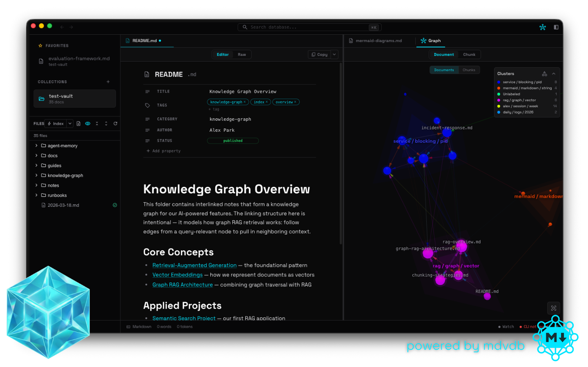
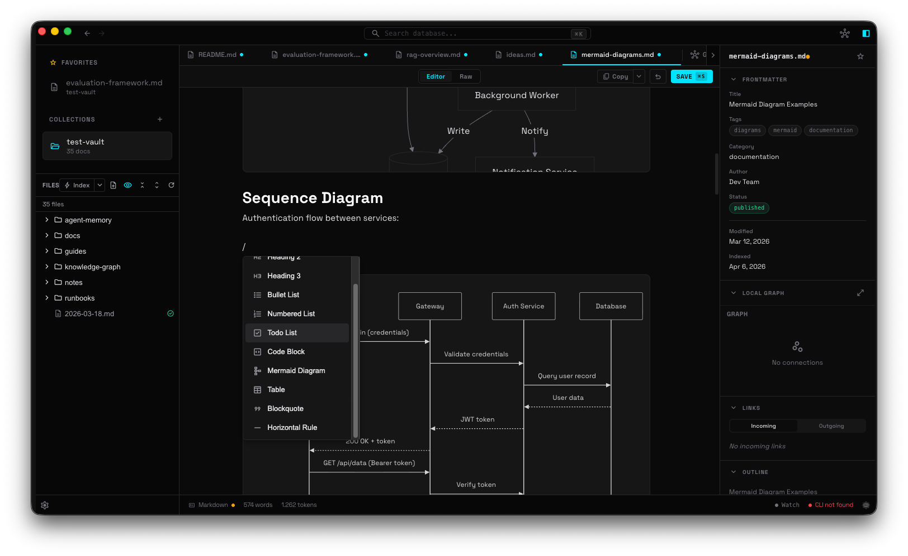
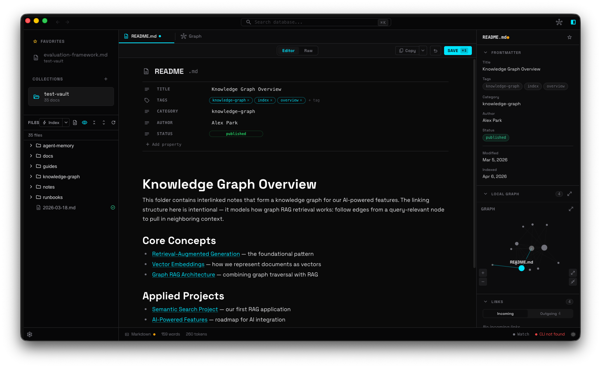
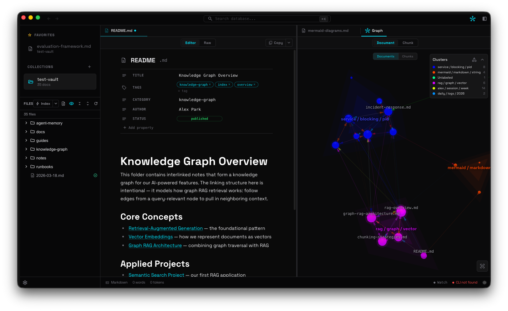
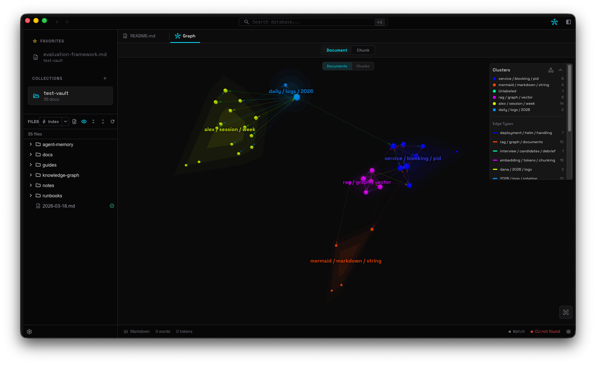
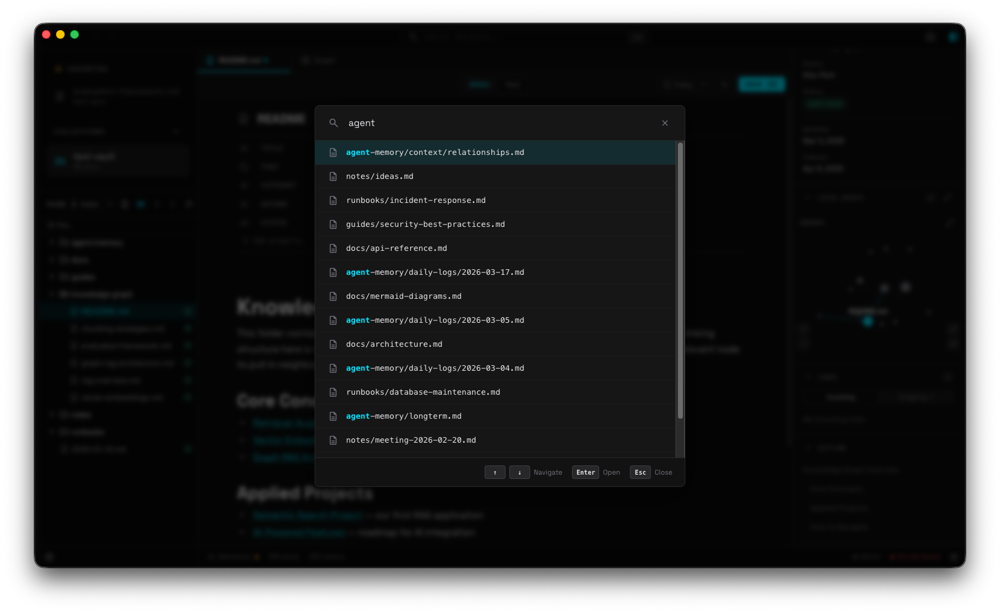

<p align="center">
  
</p>

# Tesseract

**Desktop knowledge base with visual knowledge graphs.**

Turn your Markdown files into an interactive, searchable knowledge graph. Your files, your machine, your data.

[](LICENSE)
[](https://github.com/geckse/tesseract-md-app)
[](https://obsidian.md)

---

## What is Tesseract?

Tesseract is an open-source desktop app for building and exploring knowledge bases. Write in Markdown, link your ideas with wikilinks, and navigate your knowledge spatially through interactive 3D graphs. Everything runs locally on your machine — no accounts, no cloud, no lock-in.

Under the hood, Tesseract is powered by [**mdvdb**](https://github.com/geckse/markdown-vdb) — a state-of-the-art, ultra-performant Rust-based vector database purpose-built for Markdown. mdvdb handles semantic search, link graph traversal, clustering, full-text indexing, and metadata inference at near-instant speeds, giving Tesseract capabilities that would otherwise require cloud infrastructure.

## Key Features

<details>
<summary><strong>3D Knowledge Graph</strong></summary>

Visualize how your notes connect in an interactive WebGL 3D graph. Orbit, zoom, and drag nodes to explore your knowledge spatially. Related notes auto-group into clusters, link directions show how ideas flow, and multi-hop traversal uncovers distant relationships.
</details>

<details>
<summary><strong>Hybrid Search (Semantic + Lexical)</strong></summary>

Search by meaning, not just keywords. Find relevant notes even when they use completely different words. Three modes — semantic (meaning-based), lexical (keyword), and hybrid (both combined) — so you always find what you're looking for.
</details>

<details>
<summary><strong>Frontmatter Filtering</strong></summary>

Filter search results by frontmatter metadata. Combine semantic search with structured queries like `--filter status=published` to narrow results by any frontmatter field. Supports equality, range, set membership, and existence checks. mdvdb auto-infers your schema, so there's nothing to configure.
</details>

<details>
<summary><strong>Notion-Like Markdown Editor</strong></summary>

Three editing modes to match how you think:
- **Source** — CodeMirror 6 with syntax highlighting for those who think in Markdown
- **WYSIWYG** — Notion-like block editor (TipTap) with slash commands, drag-and-drop blocks, and floating toolbars
- **Preview** — Clean rendered output with Mermaid diagram support
</details>

<details>
<summary><strong>Wikilinks & Backlinks</strong></summary>

Type `[[page]]` to link any note. Backlinks update automatically — see every note that references the current one. Find orphaned notes before they're forgotten. Your knowledge becomes a web, not a filing cabinet.
</details>

<details>
<summary><strong>Auto-Inferred Relationships</strong></summary>

mdvdb automatically infers relationships between your documents — semantic similarity, shared clusters, link neighborhoods — without any manual tagging. Edges in your knowledge graph aren't just explicit links; they're discovered connections surfaced by vector embeddings and graph traversal.
</details>

<details>
<summary><strong>Multi-Tab & Split Panes</strong></summary>

Work across multiple documents simultaneously with VS Code-style tabs and split panes. Each tab maintains its own scroll position, cursor, and undo history. Open a graph in one pane and a document in the other.
</details>

<details>
<summary><strong>Multi-Window</strong></summary>

Open as many independent windows as you need (`Cmd+Shift+N`). Each window has its own tabs, layout, and session — all persisted across restarts.
</details>

<details>
<summary><strong>Properties Panel (Frontmatter)</strong></summary>

Document info, frontmatter editor, heading outline, links & backlinks explorer, and a local neighborhood graph — all in a collapsible sidebar.
</details>

<details>
<summary><strong>File Tree with Sync Status</strong></summary>

Hierarchical navigation with word counts, link counts, and index status indicators. Drag-and-drop reorganization, context menus, and asset detection for images, PDFs, and media files.
</details>

<details>
<summary><strong>Collections</strong></summary>

Manage multiple knowledge bases. Each collection has its own index, theme, and accent color. Switch between projects instantly.
</details>

<details>
<summary><strong>Local-First & Private</strong></summary>

Everything stays on your machine. No cloud sync. No account required. Plain `.md` files — take your notes anywhere.
</details>

<details>
<summary><strong>Open Source</strong></summary>

MIT licensed. Audit the code, fork it, contribute.
</details>

---

## Tesseract vs Obsidian

| | **Tesseract** | **Obsidian** |
|---|---|---|
| **License** | MIT open source | Proprietary |
| **Search engine** | Semantic + lexical hybrid (mdvdb, Rust) | Keyword-only |
| **Search by meaning** | Yes — finds related ideas even with different words | No |
| **Knowledge graph** | Interactive 3D (WebGL) with cluster grouping | 2D flat graph |
| **Auto-inferred edges** | Yes — mdvdb discovers semantic relationships, clusters, and neighborhoods automatically | No — only explicit links shown |
| **Clustering** | Automatic document clustering with keyword labels via mdvdb | Not available |
| **CLI integration** | Native CLI (`mdvdb`) — ingest, search, status, doctor, watch from terminal | No CLI |
| **Agent-friendly** | JSON output from CLI, designed for AI agent workflows | Not designed for agents |
| **Vector database** | Built-in (HNSW via usearch, zero-copy rkyv, mmap) | None |
| **Link graph analysis** | Multi-hop traversal, orphan detection, backlink boosting, neighborhood expansion | Basic backlinks |
| **Full-text search** | BM25 via Tantivy with RRF fusion | Basic text matching |
| **Editor modes** | Source (CodeMirror) + WYSIWYG (TipTap) + Preview | Source + Preview |
| **WYSIWYG editing** | Block editor with slash commands, drag handles, bubble menus | Live Preview (not true WYSIWYG) |
| **Mermaid diagrams** | Built-in rendering | Plugin required |
| **Split panes** | Yes | Yes |
| **Multi-window** | Yes | Yes |
| **Local-first** | Yes | Yes |
| **Plain Markdown** | Yes | Yes |
| **Platforms** | macOS, Windows, Linux | macOS, Windows, Linux |
| **Price** | Free | Free (personal), paid for commercial/sync/publish |
| **Plugin ecosystem** | Early stage | Extensive |
| **Mobile app** | Not yet | Yes |

---

## Powered by mdvdb

Tesseract delegates all heavy lifting to [**mdvdb**](https://github.com/geckse/markdown-vdb), a filesystem-native vector database written in Rust:

- **HNSW vector index** (usearch) — sub-millisecond nearest-neighbor search
- **BM25 full-text search** (Tantivy) — lexical search with RRF fusion
- **Zero-copy deserialization** (rkyv + memmap2) — instant index loading
- **Link graph engine** — extraction, backlinks, multi-hop BFS, orphan detection
- **K-means clustering** (linfa) — automatic document grouping with TF-IDF labels
- **Schema inference** — auto-detect frontmatter field types across your vault
- **Content-hash skip** — only re-embed changed files (SHA-256)
- **File watcher** — incremental re-indexing on save

The CLI speaks JSON, making it a first-class tool for scripting, automation, and AI agent integration:

```bash
mdvdb ingest                          # Index your markdown files
mdvdb search "query" --json           # Semantic search
mdvdb search "query" --mode hybrid    # Combined semantic + keyword
mdvdb clusters --json                 # View document clusters
mdvdb links note.md                   # Outgoing + incoming links
mdvdb tree                            # File tree with sync status
mdvdb doctor                          # Diagnostic health check
```

---

## Getting Started

### Download

Grab the latest release for your platform:

- **macOS** — `.dmg`
- **Windows** — `.exe` installer
- **Linux** — `.AppImage`

> [Releases on GitHub](https://github.com/geckse/tesseract-md-app/releases)

### Build from Source

```bash
# Clone the repository
git clone https://github.com/geckse/tesseract-md-app.git
cd tesseract-md-app

# Install dependencies
npm install

# Run in development mode
npm run dev

# Build for production
npm run build
```

Requires the `mdvdb` CLI binary on your PATH. Install it from [markdown-vdb](https://github.com/geckse/markdown-vdb).

---

## Development

```bash
npm run dev           # Start with hot reload
npm run build         # Production build
npm run test          # Unit tests (Vitest)
npm run test:e2e      # E2E tests (Playwright)
npm run lint          # ESLint + Prettier
npm run typecheck     # TypeScript strict mode
```

### Tech Stack

| Layer | Technology |
|---|---|
| Desktop runtime | Electron |
| UI framework | Svelte 5 |
| Source editor | CodeMirror 6 |
| WYSIWYG editor | TipTap 3 (ProseMirror) |
| 3D graph | 3d-force-graph (Three.js + d3-force-3d) |
| Styling | Tailwind 4 + CSS custom properties |
| Build | electron-vite (Vite 6) |
| Search & indexing | mdvdb (Rust CLI) |
| Testing | Vitest + Playwright |

---

## Screenshots

<p align="center">
  
  <br/><em>Rich Markdown editing with WYSIWYG and source modes</em>
</p>

<p align="center">
  
  <br/><em>Notion-like feature-rich block editor with slash commands and drag handles</em>
</p>

<p align="center">
  
  <br/><em>Side-by-side editing with split panes</em>
</p>

<p align="center">
  
  <br/><em>Interactive 3D knowledge graph with cluster grouping</em>
</p>

<p align="center">
  
  <br/><em>Semantic search — find notes by meaning, not just keywords</em>
</p>

---

## License

MIT
